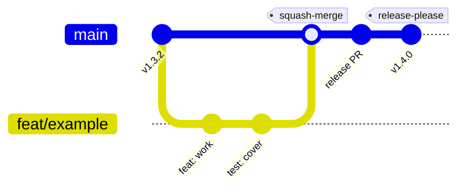
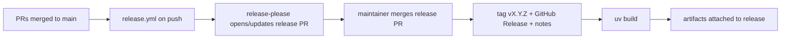

# Contributing to Nest

This document describes how changes flow from a working branch to a published
release. The goal is a **trunk-based workflow** with a protected `main`, fast
automated validation on every change, and a fully repeatable release pipeline.

---

## Branching strategy

`main` is the single long-lived branch. It is always releasable and is
protected — nothing lands on it except through a reviewed pull request that
passes CI.

All work happens on **short-lived branches** cut from `main` and named after the
Conventional Commit type of the change:

| Prefix     | Use for                                   | Release impact |
| ---------- | ----------------------------------------- | -------------- |
| `feat/`    | New user-facing capability                | minor          |
| `fix/`     | Bug fix                                   | patch          |
| `refactor/`| Internal restructuring, no behavior change| none           |
| `docs/`    | Documentation only                        | none           |
| `test/`    | Tests only                                | none           |
| `chore/`   | Tooling, deps, housekeeping               | none           |
| `ci/`      | CI/CD and pipeline changes                | none           |

Example: `feat/sync-parallelism`, `fix/symlink-discovery`.

Keep branches small and focused. Rebase on `main` rather than merging `main`
into your branch to keep history linear.



---

## Commit and PR conventions

All commits and PR titles follow
[Conventional Commits](https://www.conventionalcommits.org/). This is not
cosmetic: **release-please** derives the semantic version bump and the changelog
directly from commit subjects on `main`.

```
<type>(<optional scope>): <subject>

feat(sync): add cross-file parallelism
fix(discovery): keep symlinked files under the sources dir
feat!: drop Python 3.9 support        # breaking change → major
```

- `feat:` → **minor** bump
- `fix:` → **patch** bump
- `feat!:` / `fix!:` / `BREAKING CHANGE:` → **major** bump

PRs are **squash-merged**, so the PR title becomes the commit subject on `main`.
The `PR Validation` workflow enforces the Conventional Commit format (and checks
the branch-name convention).

---

## Local validation

The [`Makefile`](Makefile) is the single source of truth for every check. Run
the same gate CI runs before opening a PR:

```bash
make ci          # lint + format-check + typecheck + all tests (incl. e2e)
```

Individual targets:

```bash
make lint          # ruff check
make format-check  # ruff format --check
make format        # auto-format
make typecheck     # pyright (strict)
make test          # unit + integration tests (fast)
make test-e2e      # end-to-end tests (require Docling ML models, slow)
```

---

## Continuous integration

Two workflows guard every pull request (see [.github/workflows/](.github/workflows)):

- **CI** (`ci.yml`) — runs on every PR to `main` and on pushes to `main`:
  - `quality`: lint, format check, and strict `pyright` type checking.
  - `test`: unit + integration tests (single run — `uv` installs a compatible
    Python from the project's `requires-python`).
  - `e2e`: full end-to-end suite against real Docling. The ~2.5 GB of ML models
    are cached between runs; AI-gated tests use the shared test proxy from
    `tests/e2e/conftest.py`.
  - `ci-success`: single aggregate check to require in branch protection.

- **PR Validation** (`pr-validation.yml`) — validates the Conventional Commit
  format of the PR title (required) and the branch-name convention (advisory).

### Branch protection for `main`

Configured to enforce the trunk-based flow:

- Require a pull request before merging.
- Require the **`CI success`** and **`Validate PR title`** status checks to pass.
- Require branches to be up to date before merging.
- Require linear history (squash-merge only).

---

## Release pipeline

Releases are **fully automated by [release-please](https://github.com/googleapis/release-please)** —
there is no local release script. A release is simply: the change is on `main`,
tagged with a proper semver tag, and published as a GitHub Release with generated
notes.
The day-to-day flow

A developer merging a feature PR **does not** wait for release-please and does
**not** approve anything extra. You just merge your feature PR and move on.

1. **Merge your feature/fix PR** to `main`. That's it — your work is done. CI
   publishes nothing yet.
2. In the background, release-please keeps a **release PR** (branch
   `release-please--main`, titled e.g. *"chore(main): release nest 1.4.0"*)
   open and continuously up to date. It accumulates every merged Conventional
   Commit, computes the next version, and previews the `CHANGELOG.md` entries.
   You never edit this by hand — it regenerates itself on each merge.
3. **When the maintainer decides "let's cut a release"**, they simply merge that
   existing release PR. This is the single deliberate human action.
4. On that merge, release-please creates the `vX.Y.Z` tag and the GitHub Release
   with notes, and the workflow attaches the built `dist/*` artifacts.

In short: feature-PR authors merge and forget; the **only** deliberate step is
the maintainer merging the standing release PR whenever they want to shipmmit types (`feat` → minor, `fix` → patch,
`feat!`/`BREAKING CHANGE:` → major).



### Installing a released version

```bash
uv tool install git+https://github.com/jbb10/nest            # latest default branch
uv tool install git+https://github.com/jbb10/nest@vX.Y.Z     # a specific release
```
