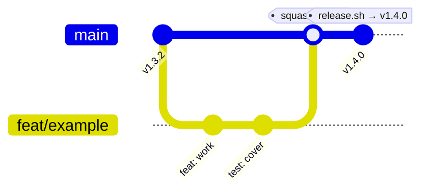
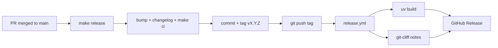

# Contributing to Nest

This document describes how changes flow from a working branch to a published
release. The goal is a **trunk-based workflow** with a protected `main`, fast
automated validation on every change, and a fully repeatable release pipeline.

---

## Branching strategy

`main` is the single long-lived branch. It is always releasable and is
protected — nothing lands on it except through a reviewed pull request that
passes CI.

All work happens on **short-lived branches** cut from `main` and named after the
Conventional Commit type of the change:

| Prefix     | Use for                                   | Release impact |
| ---------- | ----------------------------------------- | -------------- |
| `feat/`    | New user-facing capability                | minor          |
| `fix/`     | Bug fix                                   | patch          |
| `refactor/`| Internal restructuring, no behavior change| none           |
| `docs/`    | Documentation only                        | none           |
| `test/`    | Tests only                                | none           |
| `chore/`   | Tooling, deps, housekeeping               | none           |
| `ci/`      | CI/CD and pipeline changes                | none           |

Example: `feat/sync-parallelism`, `fix/symlink-discovery`.

Keep branches small and focused. Rebase on `main` rather than merging `main`
into your branch to keep history linear.



---

## Commit and PR conventions

All commits and PR titles follow
[Conventional Commits](https://www.conventionalcommits.org/). This is not
cosmetic: the release tooling (`git-cliff` + `scripts/release.sh`) derives the
semantic version bump and the changelog directly from commit subjects.

```
<type>(<optional scope>): <subject>

feat(sync): add cross-file parallelism
fix(discovery): keep symlinked files under the sources dir
feat!: drop Python 3.9 support        # breaking change → major
```

- `feat:` → **minor** bump
- `fix:` → **patch** bump
- `feat!:` / `fix!:` / `BREAKING CHANGE:` → **major** bump

PRs are **squash-merged**, so the PR title becomes the commit subject on `main`.
The `PR Title` workflow enforces the Conventional Commit format.

---

## Local validation

The [`Makefile`](Makefile) is the single source of truth for every check. Run
the same gate CI runs before opening a PR:

```bash
make ci          # lint + format-check + typecheck + all tests (incl. e2e)
```

Individual targets:

```bash
make lint          # ruff check
make format-check  # ruff format --check
make format        # auto-format
make typecheck     # pyright (strict)
make test          # unit + integration tests (fast)
make test-e2e      # end-to-end tests (require Docling ML models, slow)
```

---

## Continuous integration

Two workflows guard every pull request (see [.github/workflows/](.github/workflows)):

- **CI** (`ci.yml`) — runs on every PR to `main` and on pushes to `main`:
  - `quality`: lint, format check, and strict `pyright` type checking.
  - `test`: unit + integration tests across Python 3.10, 3.11, and 3.12.
  - `ci-success`: single aggregate check to require in branch protection.

  e2e tests are **not** run in CI: they need ~1.5 GB of Docling ML models and
  are far too slow/heavy per PR. Run them locally with `make test-e2e`.

- **PR Title** (`pr-title.yml`) — validates the Conventional Commit format of
  the PR title so squash-merge subjects stay release-compatible.

### Recommended branch protection for `main`

- Require a pull request before merging (at least 1 approval).
- Require the **`CI success`** status check to pass.
- Require branches to be up to date before merging.
- Require linear history (squash-merge only).

---

## Release pipeline

Releasing is a two-stage pipeline: a **local, guarded step** that produces the
version bump and tag, and a **CI step** that publishes the release.

### 1. Cut the release locally

From an up-to-date `main`:

```bash
make release          # → ./scripts/release.sh --yes
```

`scripts/release.sh`:

1. Verifies a clean working tree on `main` and pulls the latest.
2. Determines the bump (major/minor/patch) from Conventional Commits since the
   last tag (override with `--patch` / `--minor` / `--major`).
3. Updates `pyproject.toml` and `src/nest/__init__.py`.
4. Regenerates `CHANGELOG.md` with `git-cliff`.
5. Runs the full `make ci` gate and rolls back on failure.
6. Creates the `chore(release): vX.Y.Z` commit, the annotated `vX.Y.Z` tag, and
   moves the `latest` tag.
7. Pushes the branch and tags after a final confirmation.

Requires: `uv`, `git`, `git-cliff`, `perl`.

### 2. Publish via GitHub Actions

Pushing the `vX.Y.Z` tag triggers the **Release** workflow (`release.yml`),
which:

1. Verifies the tag matches the `pyproject.toml` version.
2. Builds the sdist + wheel with `uv build`.
3. Extracts the release notes for the version with `git-cliff`.
4. Publishes a GitHub Release with the notes and build artifacts attached.



### Installing a released version

```bash
uv tool install git+https://github.com/jbb10/nest            # latest default branch
uv tool install git+https://github.com/jbb10/nest@vX.Y.Z     # a specific release
uv tool install git+https://github.com/jbb10/nest@latest     # newest release tag
```
